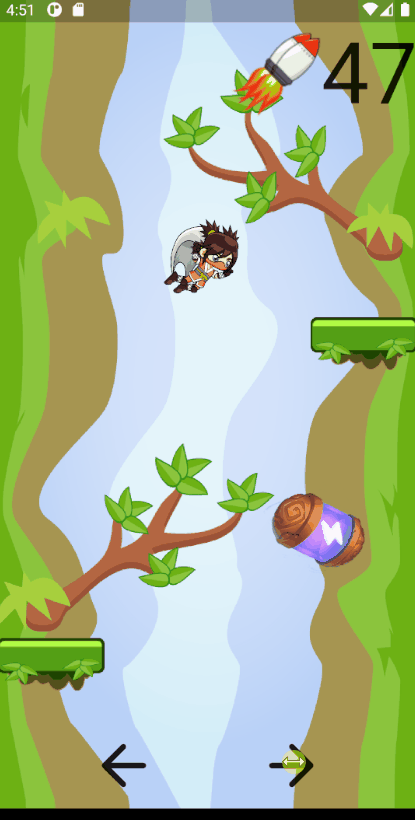

# Flutter Flame Simplified Platform Jump Example

Using SpriteComponent.

Simplified collision detection for beginners.
Flame has collision detection features built in, so you
should keep advancing and explore the Flame features once you
understand the basic concept.

